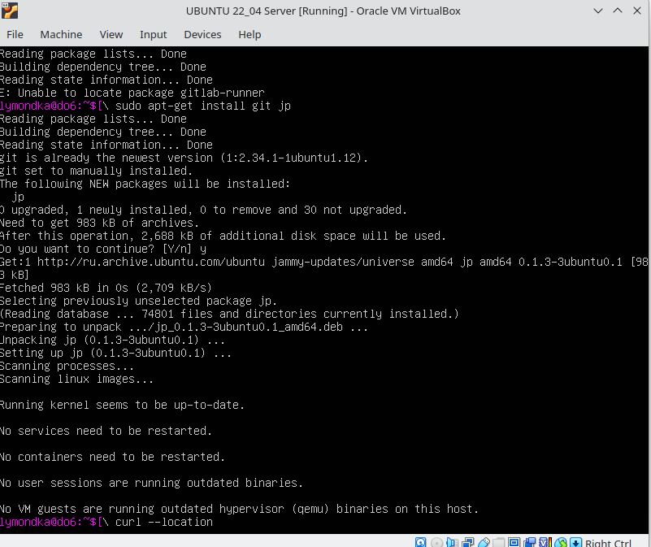
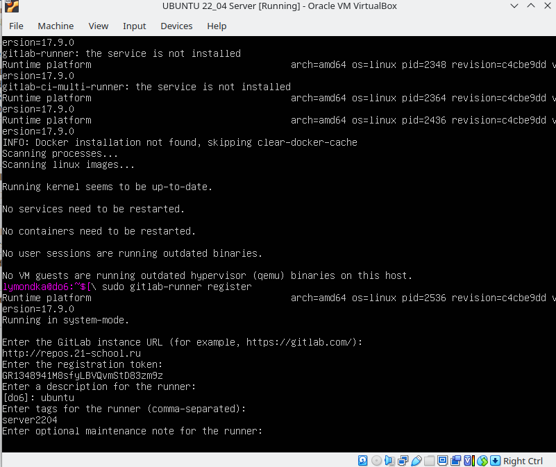
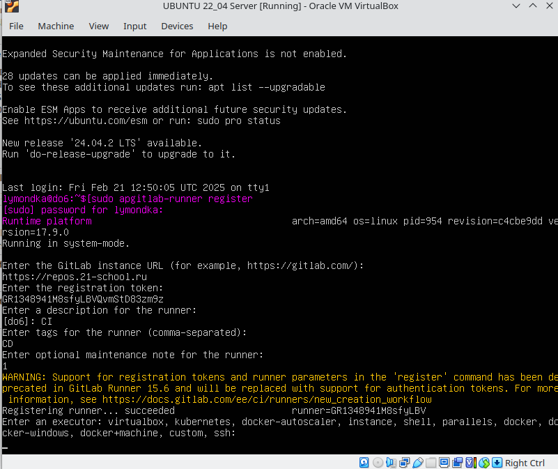
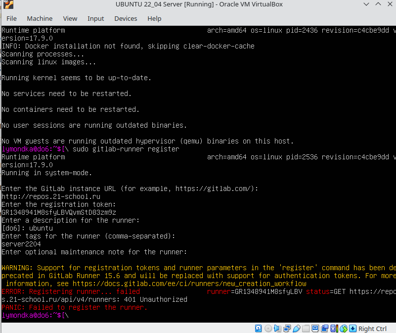

## Настройка gitlab-runner

##### 1. Поднять виртуальную машину *Ubuntu Server 22.04 LTS*.
##### 2. Скачай и установи на виртуальную машину *gitlab-runner*.  

  удаленное соединение  

 
Орагнизовать удаленное соединение: доступ в терминал виртуалки с хоста или любой другой виртуальной машины с интерфейсом, что бы вручную не вписывать команды регистарции у установки *gitlab-runner*  
-  в настройках виртуальной машины выбрать адптер сетевой мост.   
`ip a` - запросить адрес, по этому адресу пропинговать с другой машины пинг должен проходить, или с хоста так же проходит пинг

> Включить терминал можно комбинацией `Ctr+Alt+T`

 - проверим что `ssh` работает - `sudo systemctl status sshd`  
 - если не работет включить - `sudo apt-get install ssh` -  раскомитить 22 порт в файле `/etc/ssh/sshd_config`   
-  подключаться с удаленной машины командой - `ssh <username>@<ipname>` - ввесить пароль при запросе   
- установить `gitlab runner` `*https://docs.gitlab.com/runner/install/linux-repository/*`   

> `gitlab-runner status` - Проверяет статус работающего сервиса GitLab Runner.

##### 3 Запусти gitlab-runner и зарегистрируй его для использования в текущем проекте (DO6_CICD).

Для регистрации понадобятся URL и токен

  Регистрация GitLab Runner: 

1. Запустите команду `gitlab-runner register`  
2. Введите `URL` вашего `GitLab` экземпляра  
3. Введите токен регистрации, который вы скопировали ранее  
4. Придумайте описание для вашего Runner'а. Это может быть что-то вроде "Linux Runner for project X".   
5. Введите теги для Runner'а (через запятую), если нужно. Теги используются для привязки Runner'а к конкретным задачам в вашем CI/CD.   
6. Можно добавить примечание по обслуживанию. Например, указать характеристики сервера. 
7. Выберите тип executor'а. Самые распространенные варианты:
shell: Задачи выполняются непосредственно на сервере, где установлен Runner. 
docker: Задачи выполняются в Docker контейнерах. 
Если выбрали docker, нужно будет указать образ, например, alpine. 

эти картинки можно удалить

  
  
  
  
