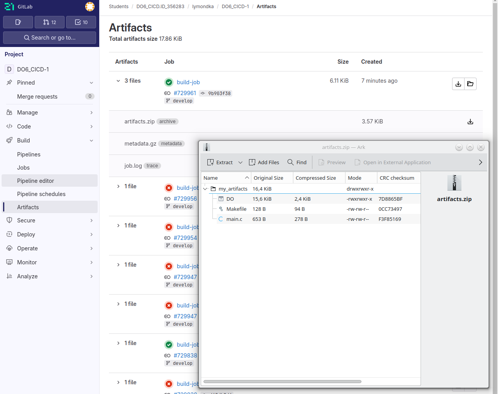

## Настройка gitlab-runner

##### 1. Поднять виртуальную машину *Ubuntu Server 22.04 LTS*.
##### 2. Скачай и установи на виртуальную машину *gitlab-runner*.  

<details>
<summary>  удаленное соединение  </summary>
 
Орагнизовать удаленное соединение: доступ в терминал виртуалки с хоста или любой другой виртуальной машины с интерфейсом, что бы вручную не вписывать команды регистарции у установки *gitlab-runner*  
-  в настройках виртуальной машины выбрать адптер сетевой мост.   
`ip a` - запросить адрес, по этому адресу пропинговать с другой машины пинг должен проходить, или с хоста так же проходит пинг

> Включить терминал можно комбинацией `Ctr+Alt+T`

 - проверим что `ssh` работает - `sudo systemctl status sshd`  
 - если не работет включить - `sudo apt-get install ssh` -  раскомитить 22 порт в файле `/etc/ssh/sshd_config`   
-  подключаться с удаленной машины командой - `ssh <username>@<ipname>` - ввесить пароль при запросе   
- установить `gitlab runner` `*https://docs.gitlab.com/runner/install/linux-repository/*`   

> `gitlab-runner status` - Проверяет статус работающего сервиса GitLab Runner.
> для выхода из удоленного соединения в возврата на хост в консоли пишем exit 


</details>

##### 3 Запусти gitlab-runner и зарегистрируй его для использования в текущем проекте (DO6_CICD).

Для регистрации понадобятся URL и токен

<details>
<summary>  Регистрация GitLab Runner: </summary>

1. Запустите команду `gitlab-runner register`  
2. Введите `URL` вашего `GitLab` экземпляра  
3. Введите токен регистрации, который вы скопировали ранее
  -- дальше просто ентер ничего не задавала
5. Придумайте описание для вашего Runner'а. Это может быть что-то вроде "Linux Runner for project X".   
6. Введите теги для Runner'а (через запятую), если нужно. Теги используются для привязки Runner'а к конкретным задачам в вашем CI/CD.   
7. Можно добавить примечание по обслуживанию. Например, указать характеристики сервера. 
8. Выберите тип executor'а. Самые распространенные варианты:
shell: Задачи выполняются непосредственно на сервере, где установлен Runner.  (выбрала этот вариант)
docker: Задачи выполняются в Docker контейнерах. 
Если выбрали docker, нужно будет указать образ, например, alpine. 

</details>

<details>
<summary> в картинках </summary>

  
  
  
  
  
  
  
  
  
  
  
  
  


</details>


<details>
<summary> комнды gitlab-runner </summary>
 
```bash
sudo systemctl status gitlab-runner  # проверка статуса
 
gitlab-runner run # Запуск всех раннеров

gitlab-runner list # Список раннеров  

gitlab-runner verify # Проверка раннеров

gitlab-runner unregister --all-runners # Удаление всех раннеров

gitlab-runner unregister --name ${name_runner} # Удаление конкретного раннера

vim /etc/gitlab-runner/config.toml # Файл с конфигурациями раннеров  
```

</details>


##  Сборка

Напиши этап для CI по сборке приложения из папки code-samples DO.
В файле .gitlab-ci.yml добавь этап запуска сборки через мейк файл из папки code-samples.
Файлы, полученные после сборки (артефакты), сохрани в произвольную директорию со сроком хранения 30 дней.

<details>
<summary> ТЕОРИЯ </summary>
 
Скрипт *CI* пишется на *YAML*. `.gitlab-ci.yml` - это единственный файл, который лежит непосредственно в корне проекта. В любых других папках *GitLab* его просто не прочитает, соответственно пайплайн работать не будет.  

Для отладки и для понимания пайплайна можно использовать средство, встроенное в саму оболочку `GitLab: Build -> Pipeline Editor`.  

> Перейдем в Pipeline editor, выберем ветку develop, и нажмем кнопку Configure pipeline. Мы попадем в окно визуального редактора. По идее, команды можно писать в файле .gitlab-ci.yml напрямую. Преимущества визуального редактора – он хорошо подсвечивает ошибки в yaml синтаксисе, и иногда дает базовые подсказки. В остальном – дело вкуса.  

Для визуальной и логической компоновки ваших Jobs, здесь есть так называемые стадии -stages. Не более чем группировка. В процессе работы pipeline – можно будет смотреть, какая стадия и какая jobs в ней выполняется.  

Руководство по разработке шаблонов GitLab CI/CD (устарело)
https://docs.gitlab.com/ee/development/cicd/templates.html

</details>

<details>
<summary> простой yaml после которого pipline -passed  </summary>

```yaml
stages:
  - build

build_job:
  stage: build
  script:
    - echo "Running."
```

  
  
  
</details>

Что бы выполнялись пйплайны с make надо на машину где работает раннер  установить gcc `sudo apt -y install build-essential`

<details>
<summary> простой yaml сгеренированй AI  </summary>

<details>
<summary> результат работы </summary>

  
  

</details>

Чтобы добавить в `.gitlab-ci.yml` этап запуска сборки через make из папки code-samples, нужно добавить новый этап и задание в файл `.gitlab-ci.yml`, указав команду `make` внутри соответствующей директории, например, так:   
```yaml
default:
   # tags: [bash] #нужно будет только если при регистрации ранера бали добавлены теги

stages:          
  - build

# Это задание(job) выполняется на этапе(stage) сборки(build), который выполняется первым.
build-job:       
  stage: build
  script:
    - mkdir -p my_artifacts # Создаем директорию для артифактов
    - cd code-samples/ && make && echo "build completed"
    - cd .. && cp code-samples/* my_artifacts

  artifacts:
    paths:
      - my_artifacts/ # Или my_artifacts.zip
      - echo "artifacts saved"
    expire_in: 30 days # Устанавливаем срок хранения

```

Пояснения:
> **stages:** Определяет последовательность этапов конвейера. В данном случае есть только один этап — build.  
> **build_job:** Название вашего задания сборки.  
>  **stage: build:** Привязывает это задание к этапу build. 
>  **script:** Содержит список команд, которые будут выполнены.  
>**cd code-samples:** Эта команда переходит в директорию code-samples, где находится ваш Makefile.  
> **make build:** Эта команда запускает сборку, как определено в Makefile (предполагая, что там есть цель с названием build). Если ваша цель сборки называется по-другому, замените build на соответствующее имя  
> **artifacts:** Это основная секция для управления артефактами в задании  
> **paths:** Указывает, какие файлы или директории нужно сохранить как артефакты. В примере мы сохраняем все из директории my_artifacts/  
> **expire_in:** 30 days: Устанавливает срок хранения артефакта в днях. Срок хранения по умолчанию равен 30 дням, но это явное указание делает настройку более понятной и защищает от случайных изменений в конфигурации GitLab  


</details>


##   Тест кодстайла

этап для CI, который запускает скрипт кодстайла (clang-format)  
Если кодстайл не прошел, то «зафейли» пайплайн  
В пайплайне отобрази вывод утилиты clang-format  

```bash
sudo apt-get update && apt-get install -y clang-format # Устанавливаем clang-format
```

<details>
<summary> добавляем в файл yaml проверку стиля </summary>
 
```yaml

style-job:
    stage: clang-format
    script:
        - cp materials/linters/.clang-format  code-samples/
        - clang-format -n --Werror --verbose code-samples/*.c
    allow_failure: false
```
Если кодстайл не прошел, то "зафейлить" пайплайн
(Для этого нужно использовать флаг --Werror)
В пайплайне отобразить вывод утилиты clang-format (--verbose)

</details>

##   Интеграционные тесты

Для проекта из папки `code-samples` напиши интеграционные тесты самостоятельно.  
Тесты должны вызывать собранное приложение для проверки его работоспособности на разных случаях.  
Запусти этот этап автоматически только при условии, если сборка и тест кодстайла прошли успешно.  
Если тесты не прошли, то «зафейли» пайплайн.  
> В пайплайне отобрази вывод, что интеграционные тесты успешно прошли / провалились.

 
<details>
<summary> добавляем в файл yaml проверку </summary>

 
```yaml
test-job:
    stage: test
    needs: ["build-job", "style-job"]
    script:
        - cd code-samples/
        - test=$(make test)                 # в переменную попадет весь вывод в консоль
        # - echo $test
        # Флаг -c подавляет вывод и возвращает 1 - символ найден, и 0, если не найден.
        #- echo $(echo $test | grep -c 'FAIL')
        # Если вернется код 1, то пайплайн зафейлится.
        - if [[ $(echo $test | grep -c 'FAIL') -ne 0 ]]; then exit 1; else echo " ✅ run test completed"; fi
    allow_failure: false
```

**Needs** используется для указания последовательности выполнения этапов. Пока не пройдет сборка и тест, этап тестирования не начнется   
**Allow_failure:** false указываю для того, чтобы при ошибке пайплайн завершился и не перешел на следующий этап.

</details>

<details>
<summary> файл с тестом </summary>

 
```bash
#!/bin/bash

touch test.txt
echo "Bad number of arguments!" > test.txt
echo "Bad number!" >> test.txt
echo "Learning to Linux"  >> test.txt
echo "Learning to work with Network"  >> test.txt
echo "Learning to Monitoring"  >> test.txt
echo "Learning to extra Monitoring" >> test.txt
echo "Learning to Docker" >> test.txt
echo "Learning to CI/CD" >> test.txt
echo "Bad number!" >> test.txt

    ./DO > test1.txt
    ./DO 0 >> test1.txt
    ./DO 1 >> test1.txt
    ./DO 2 >> test1.txt
    ./DO 3 >> test1.txt
    ./DO 4 >> test1.txt
    ./DO 5 >> test1.txt
    ./DO 6 >> test1.txt
    ./DO bad >> test1.txt


    DIFF_RES="$(diff -s test.txt test1.txt )"
    if [ "$DIFF_RES" = "Files test.txt and test1.txt are identical" ]
    then
        echo "SUCCESS"
    else
        echo "FAIL"
    fi
    rm test.txt test1.txt


```

</details>

<details>
<summary> Вывод джобы </summary>

  
  

</details>
