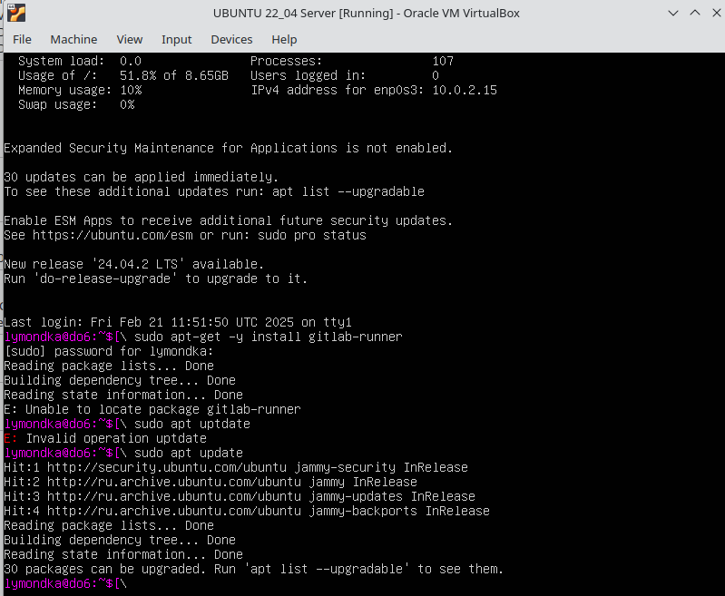

## Настройка gitlab-runner

##### 1. Поднять виртуальную машину *Ubuntu Server 22.04 LTS*.
##### 2. Скачай и установи на виртуальную машину *gitlab-runner*.  
Орагнизовать удаленное соединение: доступ в терминал виртуалки с хоста или любой другой виртуальной машины с интерфейсом, что бы вручную не вписывать команды регистарции у установки *gitlab-runner*  
-  в настройках виртуальной машины выбрать адптер сетевой мост.   
`ip a` - запросить адрес, по этому адресу пропинговать с другой машины пинг должен проходить, или с хоста так же проходит пинг

> Включить терминал можно комбинацией `Ctr+Alt+T`

 - проверим что `ssh` работает - `sudo systemctl status sshd`  
 - если не работет включить - `sudo apt-get install ssh` -  раскомитить 22 порт в файле `/etc/ssh/sshd_config`   
-  подключаться с удаленной машины командой - `ssh <username>@<ipname>` - ввесить пароль при запросе   
- установить `gitlab runner` `*https://docs.gitlab.com/runner/install/linux-repository/*`   

> `gitlab-runner status` - Проверяет статус работающего сервиса GitLab Runner.

##### 3 Запусти gitlab-runner и зарегистрируй его для использования в текущем проекте (DO6_CICD).

Для регистрации понадобятся URL и токен, которые можно получить на страничке задания на платформе.

эти картинки можно удалить

  
  
  
  
  
