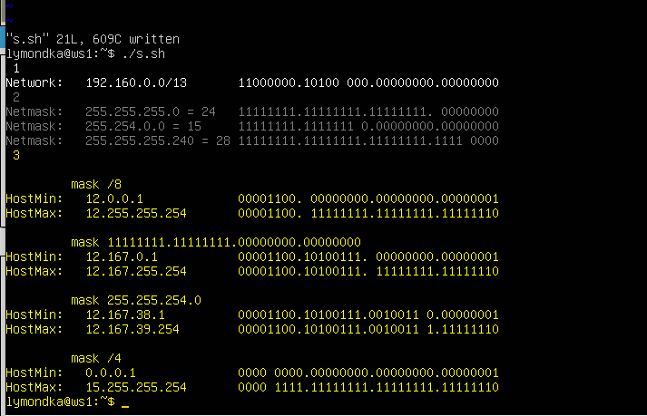
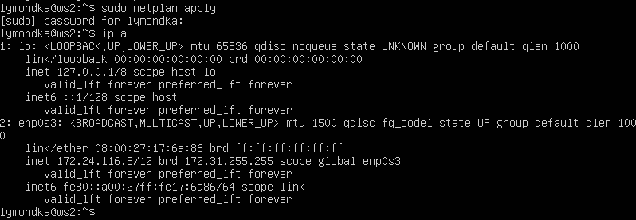
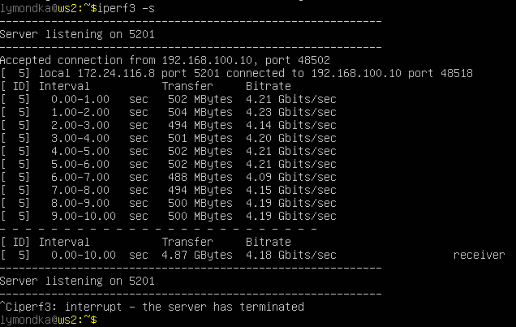

# Сети в Linux

1. [Инструмент ipcalc](#part-1-инструмент-ipcalc) 
2. [Статическая маршрутизация между двумя машинами](#part-2-статическая-маршрутизация-между-двумя-машинами) 
3. [Утилита iperf3](#part-3-утилита-iperf3) 
4. [Сетевой экран](#part-4-сетевой-экран) 
5. [Статическая маршрутизация сети](#part-5-статическая-маршрутизация-сети) 
6. [Динамическая настройка IP с помощью DHCP](#part-6-динамическая-настройка-ip-с-помощью-dhcp) 
7. [NAT](#part-7-nat) 
8. [Допополнительно. Знакомство с SSH Tunnels](#part-8-дополнительно-знакомство-с-ssh-tunnels)

 Подготовительные операции 

Перед выполнением задания сделаем экспорт виртуальной машины готовой и настроенной из первого задания DO1_Linux, в дальнейшем каждую новую машину будем брать импортом из этого образа и перенастраивать. При импорте в поле `политика MAC-адресов`выбирайте `сгенерировать новые...`   
Экспорт и импорт делается через интерфейс VirtualBox `инструменты`  
Перед экспортом и выполнением задания, убедиться (например так `ipref3 --version`)что на машинах установлены нужные утилиты, которыми будем пользоваться в ходе выполнения заданий, если их нет, то установить командой `sudo apt install ...`  
- iperf3  
- iptables  
- nmap  
- sysctl  
- tcpdump  
- traceroute  
- isc-dhcp-server ( для 6 задания на r1 и r2)  

## Part 1. Инструмент ipcalc

создадим скрипт, который выведет только нужную инфрмацию по сетям и маскам   
  
вывод   
  

### 1.2. localhost
IP  помеченые как Loopback к ним можно обратиться приложению работающему на localhost
   

### 1.3. Диапазоны и сегменты сетей

1. IP  помеченые как Private Internet являются частыми остальные общедоступные 
      

2. какие из перечисленных IP адресов шлюза возможны у сети 10.10.0.0/18:  
    - 10.0.0.1, 10.10.100.1 - не попадают в диапазон [HostMin, Hostmax]
    - 10.10.0.2, 10.10.10.10, 10.10.1.255  - возможен  
      

## Part 2. Статическая маршрутизация между двумя машинами
> - в настройах виртуальных машин задать в разделе сеть `тип подключения` - `внутренняя сеть`  (на linux - Network - Attached to - Ineternal Network)

 - Поднять две виртуальные машины **ws1** и **ws2**  
 - Посмотреть сетевой интерфейс командой `ip a` для хостов **ws1** и **ws2**  
  
  

 - Задать сетевой интерфейс, соответствующий внутренней сети, на обеих машинах и задать следующие адреса и маски:  
    - **ws1** - *192.168.100.10/16*  
    - **ws2** - *172.24.116.8/12*    
отредактировать файлы командой `sudo vim etc/netplan/00-installer-config.yaml`  
   

-  `sudo netplan apply` - Перезапустить сетевой интерфес  
    `ip a`  - проверить, что заданные адреса установлены  
  
  

### 2.1. Добавление статического маршрута вручную

- `sudo ip r add 192.168.100.10 dev enp0s3` добавить статический маршрут от одной машины до другой и обратно  
- `ping 192.168.100.0 -c 4` пропинговать соединение между машинами   
  
  
  

### 2.2. Добавление статического маршрута с сохранением
- `sudo reboot` перезапустить машины   
- `sudo vim etc/netplan/00-installer-config.yaml` добавить статический маршрут от одной машины до другой с помощью файла  
 

  

- `sudo netplan apply` перезапустить сетевой интерфес   
- Пропинговать соединение между машинами 

  
  

## Part 3. Утилита iperf3
[Теоретический матриал](../materials/iperf3_RUS.md "перейдя по ссылке посмотри как это устроено")  

### 3.1. Скорость соединения
Перевести и записать в отчёт: 8 Mbps в MB/s, 100 MB/s в Kbps, 1 Gbps в Mbps
 - 8 Mbps = 1 MB/s  
 - 100 MB/s = 800 Mbps = 819200 Kbps  
 - 1 Gbps = 1024 Mbps  

### 3.2. Утилита iperf3

- `iperf3 -s` Запустим серверную часть утилиты на **ws1**  
`iperf3 -c 192.168.100.10` - клиенсткую часть на **ws2**  
  
  
- и затем в обратную сторону:  
  
  

## Part 4. Сетевой экран

### 4.1. Утилита iptables
**задача**: контролировать информацию, проходящую по соединению. Для этого используются сетевые экраны.  

[Теоретический матриал рекомендуемый](../materials/iptables_RUS.md "...но не достаточный")  
[1) Теория подробного разбора утилиты](https://losst.pro/nastrojka-iptables-dlya-chajnikov)  
[2) Теория подробного разбора утилиты](https://wiki.dieg.info/iptables)  
  
1. Создать файл, имитирующий фаерволл, на **ws1** и **ws2**:  
`sudo touch /etc/firewall.sh`  
`sudo vim /etc/firewall.sh  ` 

> В файле описаны правила:  
iptables -F  
iptables -X  
> Нужно добавить в файл подряд следующие правила:  
>1) на **ws1** применить стратегию когда в начале пишется запрещающее правило, а в конце пишется разрешающее правило (это касается пунктов 4 и 5)  
>2) на **ws2** применить стратегию когда в начале пишется разрешающее правило, а в конце пишется запрещающее правило (это касается пунктов 4 и 5)  
>3) открыть на машинах доступ для порта 22 (**ssh**) и порта 80 (**http**)  
>4) запретить echo reply (машина не должна "пинговаться”, т.е. должна быть блокировка на `OUTPUT`)  
>5) разрешить echo reply (машина должна "пинговаться")  

- содержание файла `/etc/firewall`:  
  
  

2. Запустить файлы на обеих машинах командами:  
`sudo chmod +x /etc/firewall.sh`  
`sudo /etc/firewall.sh`  

  
  

3. Разница между стратегиями, применёнными в первом и втором файлах:  
Если сначала стоит запрещающее правило, то оно имеет приоритет перед последующим разрешающим.  

### 4.2. Утилита nmap
выполняем `nmap 192.168.100.10` для **ws2**, что бы убедиться что машина запущена и есть в сети  
  

>  Сохранить дампы образов виртуальных машин через меню `машина` - `сделать снимок` задать название и описание дампа

## Part 5. Статическая маршрутизация сети

> в настройах виртуальных машин задать в разделе сеть `тип подключения` - `внутренняя сеть`. Для роутеров в настройках в разделе сеть вкладка `адаптер 2` включаем и ставим `тип подключения` тогда машина будет распозновать 2 сети  
Поднять пять виртуальных машин (3 рабочие станции (**ws11**, **ws21**, **ws22**) и 2 роутера (**r1**, **r2**))  

Сеть имеет вид:   
  

**5.1. Настройка адресов машин**

- содержание файла `etc/netplan/00-installer-config.yaml` для каждой машины:

    

 
  

- После редактирования файла `sudo vim etc/netplan/00-installer-config.yaml` перезагружаем сеть командой `sudo netplan apply` и проверяем сетевые интерфесы командой `ip -4 a`  

  
  
  
  
  

- пропинговать **ws22** с **ws21**:  
  
пропинговать **r1** с **ws11**:  
  

**5.2. Включение переадресации IP-адресов.**  

- `sysctl -w net.ipv4.ip_forward=1` включает переадресацию IP на роутерах, но при таком подходе переадресация не будет работать после перезагрузки системы.  
  
  

- что бы IP-переадресация была включена на постоянной основе в файле`/etc/sysctl.conf` надо раскоментировать аналогичную строку:  
`net.ipv4.ip_forward = 1`  
  
 
  
  

**5.3. Установка маршрута по-умолчанию**  

> Задать имя интерфейса в файле строка `set-name: eth0`  и дополнительно надо задать макадрес, значение которого берется из  раздела сеть `тип подключения` -`дополнительно`   

- добавить `default` перед IP роутера в файле конфигураций  
Cодержание файла `etc/netplan/00-installer-config.yaml`:  
 
 
 

Вызвав `ip r` видим, что добавился маршрут в таблицу маршрутизации:  

  
  
  

Пропингуем  **ws11** и роутер **r2**  
Проверить что на **r2** пинг доходит командой:  
`sudo tcpdump -tn -i eth0`  

  

**5.4. Добавление статических маршрутов**

Cодержание изменённого файла `etc/netplan/00-installer-config.yaml`:  
 
  

Вывод команды `ip r`:  
  
  

вызов `ip r list 10.10.0.0/[маска сети]` и `ip r list 0.0.0.0/0`:  
  
> Команды ip r list 10.10.0.0/[маска сети] и ip r list 0.0.0.0/0 выполненные на **ws11** При наличии двух и более маршрутов выбирается маршрут с самой длинной маской т.к. он более точный

**5.5. Построение списка маршрутизаторов**  

`traceroute` список маршрутизаторов на пути от **ws11** до **ws21**:  
  
`sudo tcpdump -tnv -i eth0` на **r1**:  
  

> Утилита `Traceroute` вместо ICMP-запроса отправляет 3 UDP-пакета на определенный порт целевого хоста и ожидает ответа о недоступности этого порта. Первый пакет отправляется с TTL=1, второй с TTL=2 и так далее, пока запрос не попадёт адресату. Так как вместо ICMP-запроса он отправляет UDP-запрос, в каждом запросе есть порт отправителя и порт получателя. По умолчанию запрос отправляется на закрытый порт 34434. Когда запрос попадёт на хост назначения, этот хост отправит ответ о недоступности порта "Destination port unreachable" (порт назначения недоступен). Это значит, что адресат получил запрос. `Traceroute` воспримет этот ответ как завершение трассировки.  

**5.6. Использование протокола ICMP при маршрутизации**  

`sudo tcpdump -n -i eth0 icmp` **r1** перехват сетевого трафика проходящего через *eth0*:  
  
  
Пропинговать с **ws11** несуществующий `IP` (например, `10.30.0.111`)
  

>  Сохранить дампы образов виртуальных машин через меню `машина` - `сделать снимок` задать название и описание дампа

## Part 6. Динамическая настройка IP с помощью DHCP

> на роутере проверить что стоит `внутренняя сеть` в `типе подключения` на обоих адаптерах  
- Указать адрес маршрутизатора по умолчанию, DNS-сервер и адрес внутренней сети для **r2**.  
`sudo vim /etc/dhcp/dhcpd.conf`  
  

`sudo vim /etc/resolve.conf`  
  

`sudo systemctl restart isc-dhcp-server` Перезагрузить службу *DHCP* командой   
  

на **ws21** включить службу *dhcp* в файле `etc/netplan/00-installer-config.yaml` в строке вписать *true*  и закоментировать строку с адресом.  
перезагрузить **ws21** командой `sudo reboot`, проверить что появились новые адреса командой `ip -4 a`  
  

  

- Задать MAC-адрес у **ws11**, включить службу dhcp - для этого в `etc/netplan/00-installer-config.yaml` надо добавить строки: match: macaddress: 10:10:10:10:10:BA, dhcp4: true  (макадрес, его значение берется из  раздела сеть `тип подключения` -`дополнительно`)

  

- настроить **r1** аналогично **r2**, с жесткой привязкой к MAC-адресу  **ws11**(в файле есть закомченные строки которые подскажут как это сделать)  
`sudo vim /etc/dhcp/dhcpd.conf`  
  

`sudo vim /etc/resolve.conf`  
  

Перезагрузить службу DHCP командой `sudo systemctl restart isc-dhcp-server`  

на **ws21** включить службу `dhcp` в файле `etc/netplan/00-installer-config.yaml` в строке вписать true  и коментировать строку с адресом не надо, так как задаем по макадерсу.  
перезагрузить командой `sudo reboot`, проверить что появились новые адреса командой `ip -4 a`  
  

- Запрос с **ws21** обновление IP-адреса   
  

in /img/ have a scrin ping all machine

>  Сохранить дампы образов виртуальных машин через меню `машина` - `сделать снимок` задать название и описание дампа

## Part 7. NAT
 механизм преобразования адресов
на **ws22** и **r1**  
`sudo vim /etc/apache2/ports.conf` - сделать сервер Apache2 общедоступным  
`sudo service apache2 start` - запустить веб-сервер Apache командой  

 
  

На **r2** добавить в фаервол, созданный по аналогии с фаерволом из Части 4 [Сетевой экран](#part-4) , следующие правила:
> 1) удаление правил в таблице `filter - iptables -F` 
> 2) удаление правил в таблице `"NAT" - iptables -F -t nat`  
> 3) отбрасывать все маршрутизируемые пакеты - `iptables --policy FORWARD DROP`  

Запускать файл также, как в Части 4
Проверить соединение между **ws22** и **r1** командой `ping`  

При запуске файла с этими правилами, **ws22** не должна "пинговаться" с **r1**  
  

Добавить в файл ещё одно правило:
> 4) разрешить маршрутизацию всех пакетов протокола `ICMP`  
Запускать файл также, как в Части 4  
Проверить соединение между **ws22** и **r1** командой `ping`  
При запуске файла с этими правилами, **ws22** должна "пинговаться" с **r1**  

  

[ Теория ](https://interface31.ru/tech_it/2021/07/osnovy-iptables-dlya-nachinayushhih-chast-3-tablica-nat.html)  
Добавить в файл ещё два правила:
> 5) включить `SNAT`, а именно маскирование всех локальных `ip` из локальной сети, находящейся за **r2** (по обозначениям из Части 5 - сеть `10.20.0.0`) **Совет:** стоит подумать о маршрутизации внутренних пакетов, а также внешних пакетов с установленным соединением

> 6) включить `DNAT` на *8080* порт машины **r2** и добавить к веб-серверу Apache, запущенному на **ws22**, доступ извне сети
**Совет:** стоит учесть, что при попытке подключения возникнет новое `tcp`-соединение, предназначенное **ws22** и `80` порту

Проверить соединение по `TCP` для `SNAT`, для этого с **ws22** подключиться к серверу *Apache* на **r1** командой:
`telnet 10.10.0.1 80`  
Проверить соединение по `TCP` для `DNAT`, для этого с **r1** подключиться к серверу Apache на **ws22** командой `telnet  10.20.0.1 8080` (обращаться по адресу **r2** и порту `8080`)
  

>  Сохранить дампы образов виртуальных машин через меню `машина` - `сделать снимок` задать название и описание дампа

## Part 8. Дополнительно. Знакомство с SSH Tunnels
[Теоретический матриал](https://habr.com/ru/articles/331348/ "перейдя по ссылке посмотри как это устроено")  
- Запустить на **r2** фаервол с правилами из Части 7  

- Запустить веб-сервер Apache на **ws22** только на `localhost`  
(в файле `/etc/apache2/ports.conf` проприсать '`Listen localhost:80`)  
`sudo service apache2 restart` перезапустить сервер  

- Воспользоваться `Local TCP forwarding` с **ws21** до **ws22**, чтобы получить доступ к веб-серверу на **ws22** с **ws21**  
Для проверки, сработало ли подключение перейди во второй терминал клавишами `Alt + F2` и выполнить команду:
`telnet 127.0.0.1 8080` или можно   `telnet localhost 8080`  
   
   

- Воспользоваться `Remote TCP forwarding` c **ws11** до **ws22**, чтобы получить доступ к веб-серверу на **ws22** с **ws11**  
Подключаться надо **ws22**   т.к.  устанавливается ssh-соединение в обратном направлении  
Для проверки, сработало ли подключение перейди в окно VirtualBox с работающей **ws11** выполнить команду:
`telnet 127.0.0.1 8080`  
  
  

