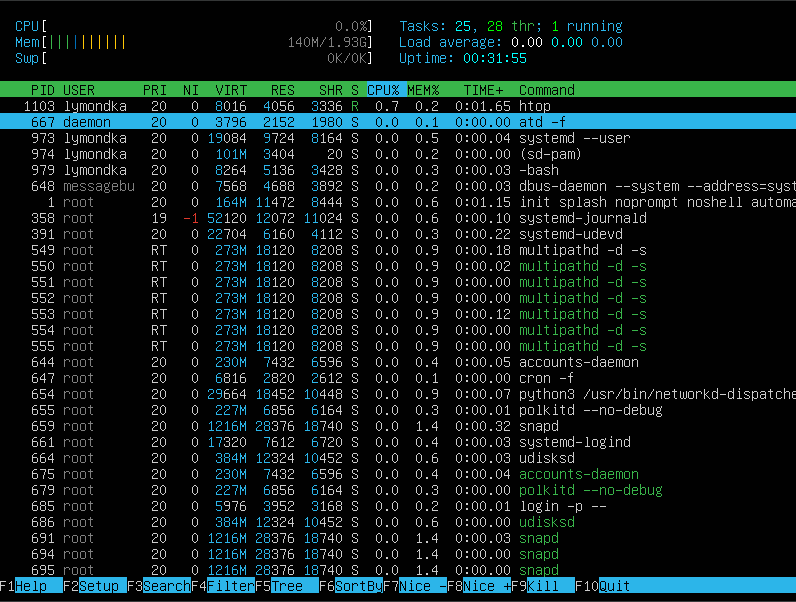

# Операционные системы UNIX/Linux (Базовый).

Установка и обновления системы Linux. Основы администрирования.

1 [Установка ОС](#part-1-установка-ос)  
2 [Создание пользователя](#part-2-создание-пользователя)  
3 [Настройка сети ОС](#part-3-настройка-сети-ос)   
4 [Обновление ОС](#part-4-обновление-ос)  
5 [Использование команды  sudo](#part-5-использование-команды-sudo)  
6 [Установка и настройка службы времени](#part-6-установка-и-настройка-службы-времени)  
7 [Установка и использование текстовых редакторов](#part-7-установка-и-использование-текстовых-редакторов)  
8 [Установка и базовая настройка сервиса SSHD](#part-8-установка-и-базовая-настройка-сервиса-sshd)   
9 [Установка и использование утилит top, htop](#part-9-установка-и-использование-утилит-top-htop)  
10 [Использование утилиты fdisk](#part-10-использование-утилиты-fdisk)  
11 [Использование утилиты df](#part-11-использование-утилиты-df)  
12 [Использование утилиты du](#part-12-использование-утилиты-du)  
13 [Установка и использование утилиты ncdu](#part-13-установка-и-использование-утилиты-ncdu)  
14 [Работа с системными журналами](#part-14-работа-с-системными-журналами)  
15 [Использование планировщика заданий CRON](#part-15-использование-планировщика-заданий-cron)  

## Part 1. Установка ОС

Установим **Ubuntu 20.04 Server LTS** без графического интерфейса, используем программу **VirtualBox** 

Проверим версию Ubuntu, выполнив команду  
`cat /etc/issue` 

 

## Part 2. Создание пользователя

- Для создания пользователя используем команду  `sudo useradd -G adm new_user`
- Проверяем что пользователь добавлен можно командой  
`ip new_user`  
или  
`cat /etc/passwd | grep new_user`  

## Part 3. Настройка сети ОС

1. Задаем название машины вида `user-1` командой `sudo hostnamectl set-hostname user-1`  
 После этого перезагружаем систему командой `reboot` и проверим что хостнейм изменился  

 hosname до изменения:  
  
 hosname после изменения:  
  
 
2. Установить временную зону, командой `sudo timedatectl set-timezone "Europe/Moscow"` 
  

3. Для вывода сетевых интерфейсов воспользуемся командой: `ip link show`  

  

>*lo (loopback device) – виртуальный интерфейс, присутствующий по умолчанию в любом Linux. Он используется для отладки сетевых программ и запуска серверных приложений на локальной машине. С этим интерфейсом всегда связан адрес 127.0.0.1. У него есть dns-имя – localhost. Посмотреть привязку можно в файле /etc/hosts.*

4. Что бы получить ip адрес устройства, на котором работаю, от DHCP сервера используем команду: `ip a`  

>*DHCP (англ. Dynamic Host Configuration Protocol — протокол динамической настройки узла) — сетевой протокол, позволяющий сетевым устройствам автоматически получать IP-адрес и другие параметры, необходимые для работы в сети TCP/IP. Данный протокол работает по модели «клиент-сервер». Для автоматической конфигурации компьютер-клиент на этапе конфигурации сетевого устройства обращается к так называемому серверу DHCP и получает от него нужные параметры.*

5. Для определения внешнего IP-адреса шлюза, выполним команду:  
`curl ifconfig.me`  
 Для определения внутреннего IP-адреса шлюза, выполним команду:  
 `ip route | grep default`  
 
  

6. Для задания статичных IP-адреса, шлюза и DNS серверов, редактируем файл  
**`/etc/netplan/00-installer-config.yaml`**  
командой  
*`sudo vim /etc/netplan/00-installer-config.yaml`*  
  
7. перезагрузим машину командой *`reboot`*  
 Проверяем командой `*ping*` удаленные хосты `1.1.1.1` и `ya.ru`  

  
  

## Part 4. Обновление ОС

 Обновить системные пакеты до последней на момент выполнения задания версии командой  
 `sudo apt update && sudo apt upgrade`  

  

## Part 5. Использование команды **sudo**

Разрешим пользователю, созданному в [Part 2](#part-2-создание-пользователя), выполнять команду sudo.  
`sudo usermod -aG sudo new_user`  
>*Команда sudo (от английского *"superuser do"*) предоставляет возможность выполнения команд с правами суперпользователя (*root*) или другого пользователя с правами администратора. В Linux безопасность очень важна, и команда `sudo` помогает предотвратить случайные или нежелательные действия с правами администратора. Вместо постоянного входа под пользователем с полными правами, вы можете временно повышать привилегии при необходимости, указав перед командой `sudo`. При этом система запросит ваш пароль для подтверждения вашей личности.*  
  
от имени пользователя поменяем хостнейм, предварительно добавим пользователю пароль командой `sudo passwd new_user`  
  

## Part 6. Установка и настройка службы времени

 Настроить службу автоматической синхронизации времени.  
 Для вывода информации о системном времени, включая состояние синхронизации с NTP-серверами, выполним команду: 
*`timedatectl show`* 
Для установки службы автоматической синхронизации времени, выполним следующую команду: 
`sudo apt install chrony` 
После установки Chrony, служба автоматической синхронизации времени будет автоматически запущена и настроена для синхронизации времени с серверами времени в сети.

 

## Part 7. Установка и использование текстовых редакторов 

 1. Установить текстовые редакторы **VIM**, **NANO**, **MCEDIT**  с помощью следующей команды: 
`sudo apt install vim nano mc`  
Используя редакторы, создадим файл *test_vim.txt, test_nano.txt test_mcedit.txt* 

**VIM**  
Для сохранения и выхода нажать `ESC` и прописать `:wq` и имя документа 
   
 
**NANO**  
Для сохранения нажать `ctrl + o`, ввести имя файла и подтвердить. Выйти через `ctrl + x`. 
   
 
**MCEDIT**  
Для сохранения нажать `F2`, затем подтвердить и после нажать `F10` для выхода. 
  

 2. Откроем каждый файл на редактирование в соответствующих редакторах и заменим свой никнейм на строку  
 `21 School 21`  
**VIM**  
Для выхода без сохранения нажать `ESC` и прописать `:q!`  

  

**NANO**  
Для выхода без сохранения `ctrl + x` и потом `N`  

  

**MCEDIT**  
Для выхода без сохранения `F10` и выбрать `No`  

  

 3. Функции поиска по содержимому файла (слово) и замены слова на любое другое.  

**VIM**  
Что бы найти слово или часть слова нажмите `ESC` ввести слеш `:s/` и слово которое ищем. Найденное слово будет подсвечено  

  

**VIM**  
Что бы найти слово или часть слова и заменить его другим необходимо нажать `ESC` ввести `:s/` и слово которое ищем снова слеш и слово на которое заменяем  

  

**NANO**  
Что бы найти слово или часть слова нажмите комбинацию клавиш `Ctrl + W` для поиска нужного слова. Найденное слово будет подсвечено. Если необходимо перейти к следующему вхождению, используйте комбинацию клавиш `Ctrl + W` повторно.  
Что бы найти слово или часть слова и заменить его другим необходимо нажать комбинацию клавиш `Ctrl + левый слэш`.  
Введите новое выражение и нажмите клавишу `Enter` для выполнения замены.  
  

**MCEDIT**  
Что бы найти слово или часть слова нажмите клавишу `F7` для перехода в режим поиска. В открывшемся окне ввести слово для поиска и необходимые парметры. Найденное слово будет подсвечено. Если нужное слово найдено, продолжайте дальше. Если необходимо перейти к следующему вхождению, используйте клавишу `F7` повторно  
  
  

**MCEDIT**  
Для замены слова нажмите клавишу `F4` откроется меню. Выберите `Replace` и введите нужное слово в поле `Find` и новое слово в поле `Replace`.найденное слово будет подсвечено, затем необходимо будет подтвердить замену  

  
  
## Part 8. Установка и базовая настройка сервиса **SSHD**

- Если службы нет, то установить службу SSHd командой `sudo apt install openssh-server`  
- Добавить автостарт службы при загрузке системы командой  
`sudo systemctl enable ssh`  
- Перенастроить службу SSHd на порт 2022. Для этого откроем файл конфигурации SSHD:  
`sudo nano /etc/ssh/sshd_config`  
В файле найдем строку с портом 22 и заменим значение порта на 2022. Уберем комментирующую решетку слева от порта. Сохраним изменения и закроем файл  

  

- Проверим наличие процесса `sshd` с помощью команды `ps` и подберем ключи для вывода нужной информации:  

`ps -aux | grep sshd`  

`ps` : выводит информацию о процессах  

`-aux` : Ключи для вывода всех процессов пользователя, включая процессы других пользователей и системные процессы  

`|` : Конвейерная команда для передачи вывода команды `ps -aux` на вход команде `grep`  

`grep sshd` : Команда для поиска процессов, связанных с `sshd`  

  

- Перезагрузить систему выполниd команду: `sudo reboot`  

Чтобы вывести состояния соединений нужно установить утилиту `netstat` командой:  
`sudo apt install net-tools`  
Теперь, чтобы убедиться, что служба слушает на порту `2022`, выполним команду:  
`netstat -tan`  

  

значения ключей и каждого столбца вывода:  
`netstat` : Команда для вывода сетевой статистики, включая информацию о сетевых соединениях и портах  

`-t` : Флаг для вывода только TCP-соединений  

`-a` : Флаг для вывода всех сетевых соединений и портов, включая слушающие  

`-n` : Флаг для вывода числовых значений портов вместо их имён  

`tcp` : Протокол TCP

`0.0.0.0:2022` : Локальный адрес 0.0.0.0 и порт 2022, что означает, что служба слушает на всех доступных IP-адресах на порту 2022

`0.0.0.0:*` : Внешний адрес 0.0.0.0 и звёздочка вместо порта, что означает, что служба слушает на всех доступных IP-адресах на любом порту

`LISTEN` : Состояние прослушивания, что означает, что служба активно слушает на этом порту и готова принимать соединения

## Part 9. Установка и использование утилит **top**, **htop**

Установить и запустить утилиты командой `sudo apt install top htop`  

  

  

- По выводу команды top:  
  - uptime - **3 min**  
  - количество авторизованных пользователей - **1**  
  - общая загрузка системы - **0.06 0.15 0.07**  
  - общее количество процессов - **100**  
  - загрузка cpu - **0.0 us, 0.0 sy, 0.0 ni, 99.7 id, 0.3 wa 0.0 hi, 0.0 si, 0.0 st**  
  - загрузка памяти - **1971.6 total, 1561.4 free, 138.5 used, 271.6 buff/cache**  
  - pid процесса занимающего больше всего памяти - **1**  
  - pid процесса, занимающего больше всего процессорного времени  - **120**  

  - вывод htop отсортированному по PID, PERCENT_CPU, PERCENT_MEM, TIME  
      
      
      
      
  - вывод отфильтрованный для процесса sshd  
     
  - с процессом syslog, найденным, используя поиск  
     
  - с добавленным выводом hostname, clock и uptime  
    

## Part 10. Использование утилиты **fdisk**

просмотреть информацию о диске можно пользователям с правами суперпользователя, выполним команду:  
`sudo fdisk -l`  
  

-  название жесткого диска - **/dev/sda**  
-  размер - **6,26G**   
-  количество секторов - **13107200**  
-  размер `swap` - **1,8G**  
>размер `swap` можно посмотреть командой `swapon --show`

## Part 11. Использование утилиты **df** 

- Информацию о дисковом пространстве, можно получить с помощью утилиты df.  

  

- Информация полученная с помощью `df /`:  
  - размер раздела - **4556480**  
  - размер занятого пространства - **2810288**  
  - размер свободного пространства  - **1494084**  
  - процент использования - **66%**  
  - единицу измерения в выводе  - **1K - кибибайт**  

- Информация полученная с помощью `df -Th /` :  

    - размер раздела - **4,4G**  
    - размер занятого пространства - **2,7G**  
    - размер свободного пространства - **1.5G**  
    - процент использования - **66%**  
    - тип файловой системы для раздела - **ext4**  

## Part 12. Использование утилиты **du**

Вывод информации о размере папок в человеко читаемом виде можно командой:`du -h`  
Для папки `home` командой:`du -h /home`  
Для папки `var` командой:`du -h /var`  
Для папки `var/log/` командой:`du -h /var/log/`  
Для папки `var/log/` вместе с вложенными элементами  командой:`du -h /var/log/*`  

  
   
   
   

## Part 13. Установка и использование утилиты **ncdu**

установить утилиту `ncdu` командой:  
`sudo apt-get install ncdu`  

`ncdu /home`  
   
`ncdu /var`  
   
`ncdu /var/log`  
   

## Part 14. Работа с системными журналами

Для просмотра системного журнала, можно использовать любой редактор или используем команду `cat` в сочетании с `grep` можно выводить только интересующую часть журнала:  
`cat /var/log/dmesg`  
`cat /var/log/syslog`  
`cat /var/log/auth.log`  
например просмотр последней успешной авторизации `cat /var/log/auth.log | grep login`  
и метод авторизации `cat /var/log/auth.log | grep lymondka`  

время последней успешной авторизации - **17 sep 18:05**  
имя пользователя - **lymondka**  
метод входа в систему - **локальны**  
  

Перезапустим службу SSHd командой `sudo systemctl restart sshd`  
проверить что служба перезапустилась можно команодой:  
`cat /var/log/syslog.log | grep sshd`  
   

## Part 15. Использование планировщика заданий **CRON**

Откроем файл cron для редактирования командой `crontab -e`  
Добавим строку, которая будет запускать команду `uptime` каждые 2 минуты в файл запишем строку  
`*/2 * * * * uptime`  
  
просмотрим что задание было выполнино минимум два раза командой  
`cat /var/log/syslog | grep uptime`  
   
Просмотрим список текущих заданий для CRON командой `crontab -l`  
   
Удалим все задания из планировщика заданий командой  
`crontab -r` и командой `crontab -l` посмотрим что заданий больше нет  
   
