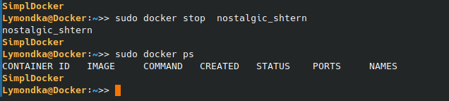
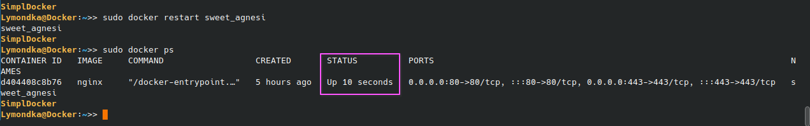

# Simple Docker

Введение в докер. Разработка простого докер-образа для собственного сервера.
<details>
<summary>chet-code</summary>
  
- `docker run имя:версия`     - запустить контейнер нужной версии
- `docker run -p 80:81 имя` - сопоставить порт 80 хоста порту 81 в контейнере
- `**docker run -v ./opt/datadir/:/var/lib/mysql имя**` - смонтировать каталог /opt/datadir/ хоста в каталог /var/lib/mysql в котнейнере
- `docker exec -it name /bin/sh` - запустить контейнер и подключить ввод вывод в терминал  
            > -i - связать стандартный ввод хоста со стандартным вводом контейнера  
            > -t - связать стандартный вывод хоста со стандартным выводом контейнера  
- echo 'qwe' | docker run -i имя - передать на ввод контейнеру строку qwe  
- `docker inspect [container_id|container_name]`  имя - детальная информация о контейнере  
- `docker logs имя` - вывести стандартный вывод контейнера
- `docker exec имя nginx -t` - проверить правильность файла nginx.conf

 - `docker pull nginx`
  -`docker images`

> посмотреть какие контейнеры есть в системе
 - `docker ps` - покажет работающие  контейнеры   
 - `docker ps -q` - покажет только ИД контейнеров  
 - `docker ps -a` - покажет все контенеры в том числе и остановленные  
 - `docker ps -aq` -  покажет только ИД всех контейнеров
 - `sudo docker stop [container_id|container_name]`
> презапуск контейнера
 - `docker restart [container_id|container_name]`
 - `docker restart $(docker ps -aq)` - перезапустить все контейнеры
 - `docker exec -it do5_ex02 cat /etc/nginx/nginx.conf > nginx.conf` -

</details>

`sudo apt install docker.io`
`sudo usermod -aG docker $USER` - добавить пользователя в группу без этой команды перед каждой командой докера придется писать судо
`dpkg -l | grep -i docker` - посмотреть какие версии докера установлены в системе 


<details>
<summary> Part 1. Готовый докер </summary> 

1. Возьми официальный докер-образ с **nginx** и выкачай его при помощи `docker pull nginx`  
  

2. Проверь наличие докер-образа через `docker images`  
  

3. Запусти докер-образ через `docker run -d [image_id|repository]`  
4. Проверь, что образ запустился через `docker ps`  
  

5. Посмотри информацию о контейнере через `docker inspect [container_id|container_name]`  
По выводу команды определи и помести в отчёт
- размер контейнера - 
- список замапленных портов - 
- ip контейнера - 

7. Останови докер контейнер через `sudo docker stop [container_id|container_name]`  
8. Проверь, что контейнер остановился через `docker ps`


9. Запусти докер с портами 80 и 443 в контейнере, замапленными на такие же порты на локальной машине, через команду *run*  
10. Проверь, что в браузере по адресу *localhost:80* доступна стартовая страница **nginx**  
  

11. Перезапусти докер контейнер через `docker restart [container_id|container_name]`  
12. Проверь любым способом, что контейнер запустился  



</details>

<details>
<summary> Part 2. Операции с контейнером</summary>


Докер-образ и контейнер готовы. Теперь можно покопаться в конфигурации **nginx** и отобразить статус страницы.

запустим контейнер задав ему удобное имя 
`sudo docker run -d -p 80:80 --name do5_ex02 nginx`
Если вдруг он не запустился проверить через команду с дирректирвой -а которая покажет все контейнеры зарегистрованные `sudo docker ps -a` статус контейнера если он exited попробовать перезапустить его командой `sudo docker restart do5_ex02` еще раз проверить статуc 
`docker rename  old_name new_name` rename running conteiner

1. Прочитай конфигурационный файл *nginx.conf* внутри докер контейнера через команду *exec*  
`sudo docker exec -it do5_ex02 cat /etc/nginx/nginx.conf`


2. Создай на локальной машине файл *nginx.conf*  
`touch nginx.conf` 

3. Настрой в нем по пути */status* отдачу страницы статуса сервера **nginx**.
  

<details>
<summary>chet-code</summary>

> в него можно скопировать все что было прочитано на прошлом шаге и добавить секцию, при этом диррективу включения конфугарации надо закомментировать то есть строку `#include /etc/nginx/conf.d/*conf;`
в противном случае можно получать при перезапуске nginx ошибку `nginx: [warn] conflicting server name "loclhost" on 0.0.0.0:80, ignored` - эта ошибка возникает из-за двух одинаковых директивы "server_name" в двух отдельных файлах *.conf.  

</details>

```
server {
  location /status{
    stub_status on;
  }
}
```  


4. Скопируй созданный файл *nginx.conf* внутрь докер-образа через команду `docker cp`  
командой из шага 1 можно проверить что файл скопирован и заменен  
`sudo docker cp nginx.conf do5_ex02:/etc/nginx/nginx.conf`  
  


5. Перезапусти **nginx** внутри докер-образа через команду *exec*
   `docker exec $(docker ps -q) nginx -t` -- rewue file nginx.conf
  

7. Проверь, что по адресу *localhost:80/status* отдается страничка со статусом сервера **nginx**  
  


8. Экспортируй контейнер в файл *container.tar* через команду *export*  
теория https://netpoint-dc.com/blog/sohranenie-i-zagruzka-obrazov-kontejnerov-docker/  
Проверь что архив создан командой ls.

9. Останови контейнер  

10. Удали образ через `docker rmi [image_id|repository]`, не удаляя перед этим контейнеры  

  

10.  Удали остановленный контейнер  

  


11. Импортируй контейнер обратно через команду *import*.
12. Запусти импортированный контейнер.
13. Проверь, что по адресу *localhost:80/status* отдается страничка со статусом сервера **nginx**.


</details>

<details>
<summary> Part 3. Мини веб-сервер</summary>

[ Скрипт который запустит сборку сервера  ](part3/p3.sh)  


Теперь стоит немного оторваться от докера, чтобы подготовиться к последнему этапу. Время написать свой сервер.
Теория + пример https://lectureswww.readthedocs.io/5.web.server/fcgi.html

Список команд в скрипте    [--Список использованных команд-- server.c ](../DEL/scripts.sh)  

   
    
  


`sudo docker exec -it $(sudo docker ps -q) /bin/sh` - Go in docker conteiner

**== Задание ==**

1. Напиши мини-сервер на **C** и **FastCgi**, который будет возвращать простейшую страничку с надписью `Hello World!`  
2. Запусти написанный мини-сервер через *spawn-fcgi* на порту 8080.
3. Напиши свой *nginx.conf*, который будет проксировать все запросы с 81 порта на *127.0.0.1:8080*  
4. Проверь, что в браузере по *localhost:81* отдается написанная тобой страничка.
5. Положи файл *nginx.conf* по пути *./nginx/nginx.conf* (это понадобится позже).
     

</details>

<details>
<summary> Part 4. Свой докер </summary>


[ Скрипт который запустит сборку сервера DOCERFILE ](part4/p4.sh)  

Теперь всё готово. Можно приступать к написанию докер-образа для созданного сервера.

**== Задание ==**

*При написании докер-образа избегай множественных вызовов команд RUN*

#### Напиши свой докер-образ, который:
##### 1) собирает исходники мини сервера на FastCgi из [Части 3](#part-3-мини-веб-сервер);
##### 2) запускает его на 8080 порту;
##### 3) копирует внутрь образа написанный *./nginx/nginx.conf*;
##### 4) запускает **nginx**.
_**nginx** можно установить внутрь докера самостоятельно, а можно воспользоваться готовым образом с **nginx**'ом, как базовым._

##### Собери написанный докер-образ через `docker build` при этом указав имя и тег.
##### Проверь через `docker images`, что все собралось корректно.
##### Запусти собранный докер-образ с маппингом 81 порта на 80 на локальной машине и маппингом папки *./nginx* внутрь контейнера по адресу, где лежат конфигурационные файлы **nginx**'а (см. [Часть 2](#part-2-операции-с-контейнером)).
##### Проверь, что по localhost:80 доступна страничка написанного мини сервера.
10. Допиши в *./nginx/nginx.conf* проксирование странички */status*, по которой надо отдавать статус сервера **nginx**
    `docker run -d -v ./nginx/nginx.conf:/etc/nginx/nginx.conf -p 80:81 nginx:ex04`
##### Перезапусти докер-образ.
*Если всё сделано верно, то, после сохранения файла и перезапуска контейнера, конфигурационный файл внутри докер-образа должен обновиться самостоятельно без лишних действий*.
##### Проверь, что теперь по *localhost:80/status* отдается страничка со статусом **nginx**

</details>


<details>
<summary> Part 5. Dockle  </summary>
  
[ Скрипт установки утилиты Dockle](part5/install_dockle.sh)    
[ Скрипт который запустит сборку сервера DOCKERFILE и проверить его на корректность](part5/p5.sh)  

После написания образа никогда не будет лишним проверить его на безопасность.

**== Задание ==**

1.  Просканируй образ из предыдущего задания через `dockle [image_id|repository]`  
2.  Исправь образ так, чтобы при проверке через **dockle** не было ошибок и предупреждений  
`dockle -ak NGINX_GPGKEY   имя:версия `   --   **CIS-DI-0010** nginx:ex05  `-ak` это `--accept-key` можно применить еще другие ключи которые можно посмотреть по хелпу этой команды, но у меня не вышло найти комбинацию
`export DOCKER_CONTENT_TRUST=1 ` # need to write  **CIS-DI-0005**   
`dockle --ignore CIS-DI-0010 имя:версия ` - точно работает   
**DKL-DI-0003** Avoid apt-get dist-upgrade - предоложения апдейта и инсталяции надо объеденять в один блок через оператор && ghbvth `RUN apt-get update && apt-get install -y ...`


</details>


<details>
<summary> Part 6. Базовый Docker Compose </summary>
  
[ Скрипт который запустит сборку сервера с помощью ocker-compose.yml ](part6/p6.sh)  


Вот ты и закончил свою разминку. А хотя погоди...
Почему бы не поэкспериментировать с развёртыванием проекта, состоящего сразу из нескольких докер-образов?

**== Задание ==**

##### Напиши файл *docker-compose.yml*, с помощью которого:
##### 1) Подними докер-контейнер из [Части 5](#part-5-инструмент-dockle) _(он должен работать в локальной сети, т. е. не нужно использовать инструкцию **EXPOSE** и мапить порты на локальную машину)_.
##### 2) Подними докер-контейнер с **nginx**, который будет проксировать все запросы с 8080 порта на 81 порт первого контейнера.
##### Замапь 8080 порт второго контейнера на 80 порт локальной машины.

##### Останови все запущенные контейнеры.
##### Собери и запусти проект с помощью команд `docker-compose build` и `docker-compose up`.
##### Проверь, что в браузере по *localhost:80* отдается написанная тобой страничка, как и ранее.


`docker-compose up -d` или `docker-compose up --detach`  
> Команда используется для создания и запуска контейнеров на заднем плане, используя готовый файл docker-compose.yaml
> Запускает сервисы в фоновом режиме без вывода логов в консоль.    

`docker-compose ps` :  
> Описание: Эта команда отображает список контейнеров, управляемых Docker Compose, вместе с их текущим состоянием и дополнительной информацией. Она показывает контейнеры, которые запущены и те, которые были созданы в рамках проекта Docker Compose.
Использование: Подходит для просмотра списка созданных и запущенных контейнеров.

`docker-compose logs`  
> Описание: Команда docker-compose logs используется для вывода логов всех контейнеров, управляемых текущим docker-compose проектом. Она позволяет видеть сообщения журнала для всех сервисов, определённых в docker-compose.yaml. По умолчанию команда показывает логи всех контейнеров, но можно использовать дополнительные параметры для фильтрации или ограничения вывода.

Пример использования: `docker-compose logs` Это выведет логи всех сервисов.

Дополнительные параметры:

`-f` или `--follow`: Следит за новыми записями в логах в реальном времени  
`--tail: Ограничивает количество выводимых строк (например, --tail=100 покажет последние 100 строк).

Пример:`docker-compose logs -f` Следит за логами всех сервисов в реальном времени.

`docker-compose up`
> Описание: Команда используется для создания и запуска контейнеров, указанных в docker-compose.yaml. Она запускает все сервисы в фоновом режиме, если используется флаг -d (detached mode). По умолчанию, если команда запускается без флага -d, она также выводит логи сервисов в консоль в реальном времени.

Пример использования: `docker-compose up` Запускает все сервисы и отображает их логи в консоль.


`docker-compose run`

> Описание: Команда используется для запуска одного разового контейнера для указанного сервиса. Это полезно для выполнения разовых задач или команд в изолированном контейнере. Она не предназначена для просмотра логов всего стека, а скорее для выполнения команд или тестов

`docker-compose start`
> Описание: Команда docker-compose start используется для запуска уже созданных контейнеров, которые были остановлены. Она не создает новые контейнеры и не выводит логи. Используется для продолжения работы существующих контейнеров после их остановки.

Пример использования: `docker-compose start` Запускает остановленные контейнеры без изменения их конфигурации.


`docker-compose stop`
> Описание: Команда останавливает все контейнеры, описанные в *docker-compose.yaml*, но не удаляет их. Контейнеры останутся на диске, и их можно будет снова запустить с помощью команды `docker-compose start`. Это полезно, когда вы хотите временно остановить работу контейнеров, сохраняя их состояние и данные.

Пример использования:`docker-compose stop` Эта команда остановит все контейнеры в стеке, но оставит их на диске.

`docker-compose down`
> Описание: Команда останавливает и удаляет все контейнеры, а также связанные с ними сети, тома и другие ресурсы, созданные в процессе работы `docker-compose up`. Это полное удаление всех ресурсов, созданных с помощью docker-compose, и не подходит для простого остановления контейнеров без удаления.

Пример использования:`docker-compose down` Эта команда останавливает и удаляет все контейнеры, связанные сети и тома. Это не то, что нужно для остановки без удаления.

`docker-compose rm`
> Описание: Команда docker-compose rm удаляет остановленные контейнеры, которые больше не запущены. Она не останавливает контейнеры, а только удаляет те, которые уже остановлены. Чтобы удалить все контейнеры, нужно сначала остановить их с помощью docker-compose stop и затем выполнить docker-compose rm.

Пример использования: `docker-compose rm` Эта команда удалит только остановленные контейнеры, оставляя активные контейнеры нетронутыми.
